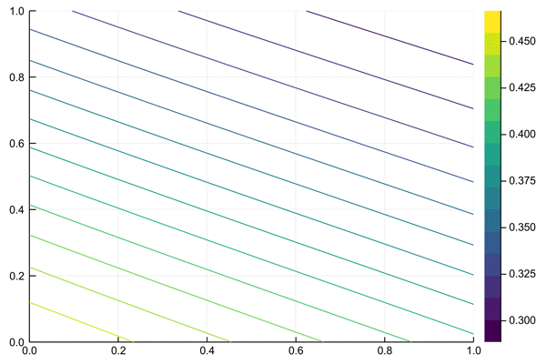
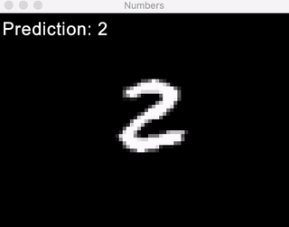

# Neural Network in Julia

# XOR problem
Neural Network Solution #1     |  Neural Network Solution #2
:-----------------------------:|:-------------------------------:
 |  
## How to
1. Get into _XOR_ folder and launch julia.  
2. Open up Julia **REPL** to avoid recompilations again and again.
3. **Launch** the xor file by typing `include("xor.jl")`

   3.1 You may need to _"install"_ the NeuralNetconn package first

   3.2 To do that put **NeuralNetconn.jl** to `/Users/{USER_NAME}/.julia/{VERSION}/NeuralNetconn/src`
   
4. Try out functions!

## Functions
+ `predictions()` - lets you see what **results** the NN currently would give for XOR problem
+ `training(iters=10000)` - **trains** the net with some fixed _learning rate_ and _number of iterations_
+ `progressive(iters=10000)` - **the best** type of **training** for this example. Shows how the net learns _over time_ using progressive change of the learning rate

Only in _plotxor.jl_

+ `plotxor()` - **generate** NN prediction plot
+ `gifxor()` - **generate** hundred .png images with prediction plot and store them inside **gif** folder

**Another solution example**



# MNIST - handwritten digits recognition

## How to
1. Get into _MNIST_ folder and launch julia.
2. Open up Julia **REPL** to avoid recompilations again and again.
3. **Launch** the mnist visualization program by typing `include("numbers.jl")`

   3.1 You may need to _"install"_ the NeuralNetconn package first

   3.2 To do that put **NeuralNetconn.jl** to `/Users/{USER_NAME}/.julia/{VERSION}/NeuralNetconn/src`
   
4. Call `main()` function
5. Wait until 3 trainings are complete (this usually gets to 92% prediction accuracy)
6. Try out functions!

## Functions
+ `training(iters=3)` - **train more** for better accuracy. Though you can only achieve ~92% with this NN.
+ `check()` - show Neural Network **accuarcy** for _60,000 MNIST images_
+ `main()` - launch MNIST + NN **visualization**

## Troubleshooting
If SFML window was _closed_ and you still want to _reopen_ it (without reincluding the file) - this is **necessary** to type in:  
```
   window = RenderWindow(VideoMode(800, 600), "Numbers")
   set_framerate_limit(window, 60)
   main()
```
...because the window has to be reconstructed after being closed.  
