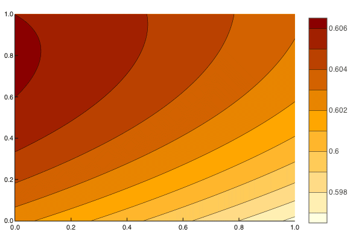
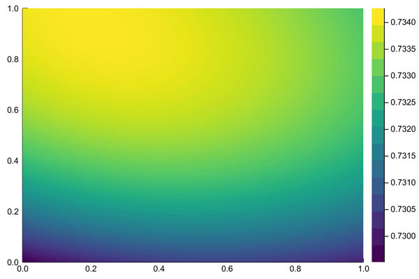

# Neural Network in Julia

# XOR problem
Solution 1                 |  Solution 2
:-------------------------:|:-------------------------:
  |  
## How to
1. Get into _XOR_ folder and launch julia.  
2. Open up Julia **REPL** to avoid recompilations again and again.
3. **Launch** the xor file by typing `include("xor.jl")`

   3.1 You may need to _"install"_ the NeuralNetconn package first

   3.2 To do that put **NeuralNetconn.jl** to `/Users/{USER_NAME}/.julia/{VERSION}/NeuralNetconn/src`
   
4. Try out functions!

## Functions
+ `predictions()` - lets you see what **results** the NN currently would give for XOR problem
+ `training(iters=10000)` - **trains** the net with some fixed _learning rate_ and _number of iterations_
+ `progressive(iters=10000)` - the best type of training for this example. Shows how the net learns over time using progressive change of the learning rate

Only in _plotxor.jl_

+ `plotxor()` - **generate** NN prediction plot
+ `gifxor()` - **generate** hundred .png images with prediction plot and store them inside **gif** folder
